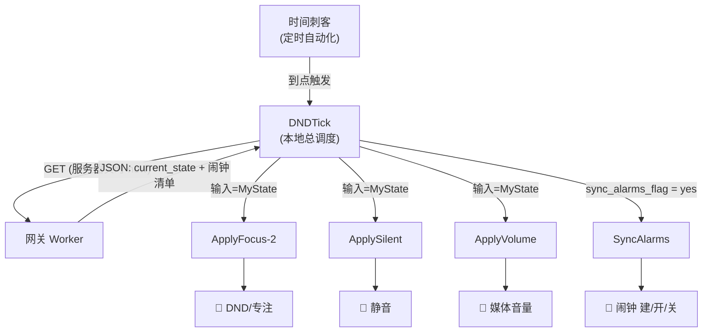
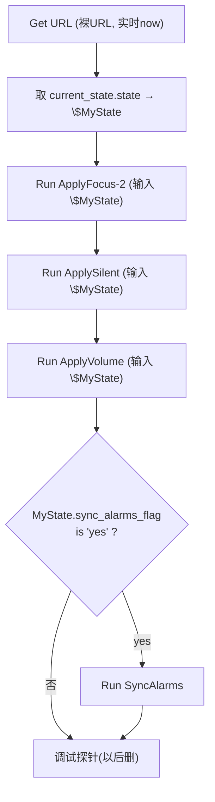
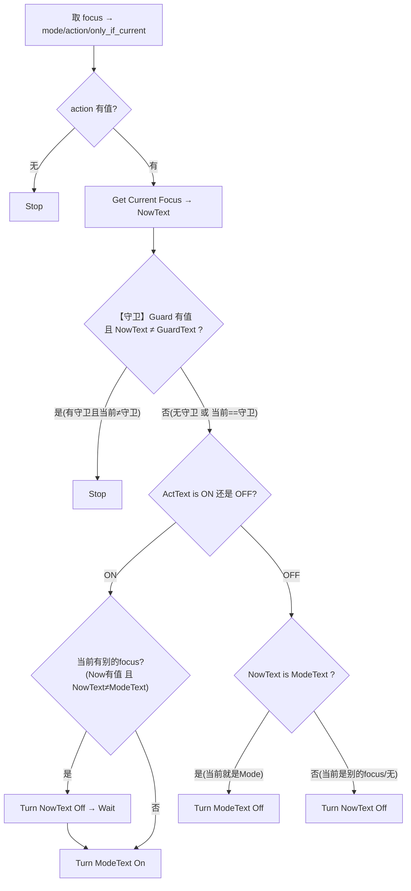
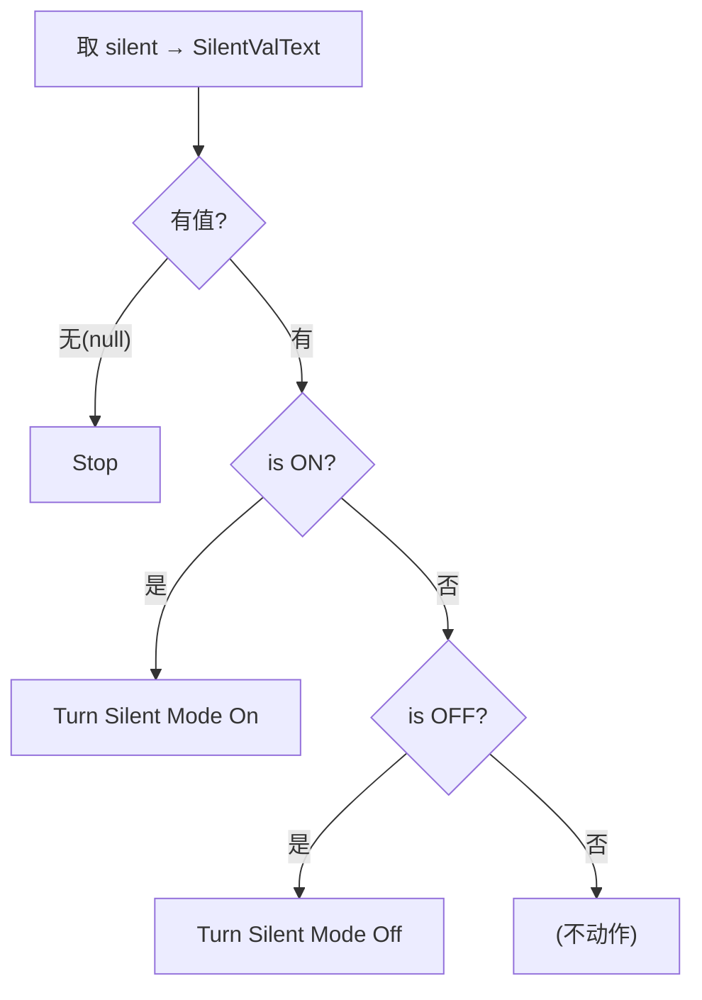
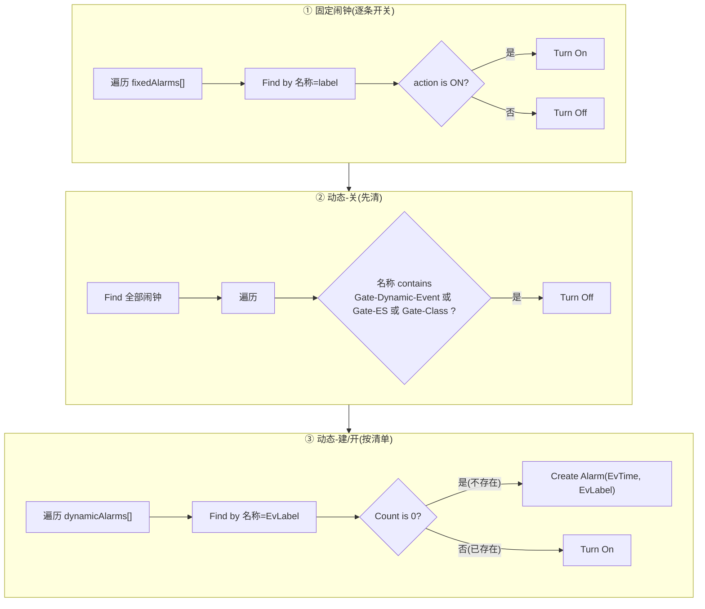

# 手机端（本地）权威文档 —— 建法 · 逐动作真实逻辑 · 流程图

> **本地端是落地的唯一执行者，线上再好，本地错了照样出问题。** 这份是手机侧的
> **单一真相源**：每个快捷指令的逐动作逻辑，严格按 iPhone「快捷指令」App 里的**真实实现**写
> （不是按线上设计想当然）。
>
> ⚠️ **两条脱节教训（务必牢记）**：
> 1. **快捷指令的 JSON 导出不完整**（例如 dnd.set 的 On/Off 标志有时不序列化），
>    **不能当唯一真相源；以 UI 实际显示为准**。本文件就是把 UI 真实逻辑固化成文字。
> 2. **线上契约 ↔ 本地实现必须同步**：改了本地逻辑（如 sweep 前缀），本文件和
>    `ARCHITECTURE.md`/`DEVLOG.md` 必须一起改，否则"文档说 A、手机做 B"。

---

## 0. 全景数据流



**契约**：网关无状态、只出"应该是什么"；本地读了自行落地。`state` 里本地会读的字段：
`focus`(对象) / `silent`("ON"/"OFF"/null) / `media_volume`(0~1/null) / `sync_alarms_flag`("yes"/"no")；
闹钟来自 `fixedAlarms[]` 与 `dynamicAlarms[]`。

---

## 1. 前置：预建闹钟 + 刺客

**预建固定闹钟**（在手机时钟 App 手工建，配好时间/铃声/震动/Label，Label 与 config.FIXED_ALARMS 逐字一致）：
`Gate-Fixed-*` 共 7 个（起床震动/响铃、寒暑假起床、节后兜底、午休、下班）。这些网关**只开关、不碰时间**。

**时间刺客**（DND.WHITELIST 每个时刻一条「个人自动化→特定时间」）：到点 `Run DNDTick`。
设为 **"运行时不询问 / Run Immediately"**，否则后台不触发。
> 现状：DNDTick 用裸 URL（服务器实时 now），刺客未传时间。因 POINT 容差仅 ±3 分钟，
> iOS 晚触发 >3 分钟会漏槽。**上线前二选一**：放宽容差到 ~10 分钟，或让刺客传 `?now=计划时间`。

---

## 2. DNDTick（总调度）

**作用**：拉网关 JSON → 分发给各执行模块。



**逐动作（真实）**：
```
[调试] Get Current Focus → $BeforeFocus → Text → $BeforeFocusText
 4  Get contents of URL   https://ios-alarm-api.akak.eu.org
 5  Get dictionary from Contents of URL
 6  Get value 'current_state'  → 7  Set $Cur
 8  Get value 'state' in $Cur  → 9  Set $MyState
10  Run Shortcut  ApplyFocus-2   输入=$MyState   ← ★显式传 MyState
11  Run Shortcut  ApplySilent    输入=$MyState
12  Run Shortcut  ApplyVolume    输入=$MyState
13  Get value 'sync_alarms_flag' in $MyState → 14 Text
15  If (那段Text) is 'yes':
16     Run Shortcut  SyncAlarms
17  End If
[调试探针 18-33] 读 now/focus/silent/media_volume/sync_alarms_flag + Get Current Focus(After)
                 → Text 模板 → Append 到备忘录   ← 本地验证用，上线删
```
**关键点**：① 三个 Run **都显式传 `$MyState`**（不靠上一步输出）；② 读 `sync_alarms_flag` 比 `'yes'`
（不是旧布尔 `sync_alarms`）；③ 调试探针（含开头 BeforeFocus 那几步）删掉后，核心是 4→17。

---

## 3. ApplyFocus-2（最需要精确的模块，守卫已内联）

**作用**：按 `state.focus` 开/关/切 DND 或专注。守卫判断内联在本指令内（**已无独立子程序 CheckFocusGuard**）。



**逐动作（真实）**：
```
输入=$MyState (state 字典)
 0 Get value 'focus'          → 1 $FocusDict     ★FocusDict 全程只在此赋值一次
 2 Get value 'action' in FocusDict → 3 $Act
 4 If $Act 没有任何值 → 5 Stop              (空指令早退)
 7 Text[$Act] → 8 $ActText
 9 Get value 'mode' in FocusDict → 10 $Mode → 11 Text → 12 $ModeText
13 Get value 'only_if_current' in FocusDict → 14 $Guard → 15 Text → 16 $GuardText
17 Get Current Focus → 18 $Now → 19 Text → 20 $NowText     ★Turn 前必先读(priming)
21 If 【全部满足 ALL】: $Guard 有任何值  且  $NowText 不是 $GuardText → 22 Stop
24 If $ActText is 'ON':
25    If 【全部满足 ALL】: $Now 有任何值 且 $NowText 不是 $ModeText:
26       Turn $NowText Off     27 Wait          (先关掉当前别的 focus，再切)
29    Turn $ModeText On (until turned off)
30 Otherwise:
31    If $ActText is 'OFF':
32       If $NowText is $ModeText:
33          Turn $ModeText Off                  (当前就是 Mode → 关 Mode)
34       Otherwise:
35          Turn $NowText Off                   (当前是别的 focus → 关掉它)
```

### ⭐ only_if_current 的语义（这是设计，别删、别忘、别自我怀疑）

`only_if_current` 字段就是为"要不要守卫"而设，语义**故意**如下：

- **focus 里有 `only_if_current`（守卫值）** → OFF 时**只在当前 focus == 守卫值时才关**（动作21守卫 + 动作32判断共同保证）。用来保护你手动开的 Sleep/Work 不被误关。
- **focus 里没有 `only_if_current`（为空）** → OFF 时**不管当前是什么 focus，一律关掉当前 focus**（动作35）。这是"到点清场"语义。

**为什么这么设计**：若无守卫就"只关 Mode"，那 `only_if_current` 这个字段就没用了。字段存在的意义，
正是让网关**按需**决定"这个 DND 解除时刻要不要挑 focus"。想守卫就在 config 里给该时刻配
`only_if_current`；不配就是无条件清场。**这是有意的，不是 bug。**
（如 07:40 配了 `"Do Not Disturb"` → 只在 DND 时解除；13:29 没配 → 到点把当前任何 focus 都清掉。）

---

## 4. ApplySilent

**作用**：按 `state.silent` 开/关静音。


```
 0 Get value 'silent' → 1 $SilentVal → 2 Text → 3 $SilentValText
 4 If $SilentVal 没有任何值 → 5 Stop
 6 Otherwise:
 7    If $SilentValText is 'ON'  → 8  Turn Silent Mode On
 9    Otherwise: If $SilentValText is 'OFF' → 11 Turn Silent Mode Off
```
**关键点**：silent 为 null（网关未设该字段）→ 停，不误动。ON/OFF 才动。

---

## 5. ApplyVolume

**作用**：按 `state.media_volume`(0~1) 设媒体音量。


```
 0 Get value 'media_volume' → 1 $MediaVol → 2 Text → 3 Count Characters
 4 If 【全部满足 ALL】: $MediaVol 有任何值 且 Count > 0:
 5    Get Numbers from Text → 6 Set Volume to (Numbers)
```
**关键点**：`media_volume=0`（静音）→ Text "0"、Count=1>0 → 能正确设成 0（**没有 falsy-0 被吞**）。
Set Volume 用 0~1 分数（已确认）。

---

## 6. SyncAlarms（闹钟对账，两段）

**作用**：固定闹钟按 action 开/关；动态闹钟"先全关、再按清单建/开"。


```
 2 Get value 'fixedAlarms'
 3 Repeat each:
 4    Get 'label' → 5 $AlarmName    6 Get 'action' → 7 $ActionStatus
 8    Find Alarms where 名称 is $AlarmName
10    If Text[$ActionStatus] is 'ON' → 11 Turn Alarms On   Otherwise → 13 Turn Alarms Off
16 Find Alarms (全部)
17 Repeat each (Alarms):
18    If 【任一 ANY】: RepeatItem contains 'Gate-Dynamic-Event' 或 'Gate-ES' 或 'Gate-Class'
19       Turn RepeatItem Off
22 Get value 'dynamicAlarms'
23 Repeat each:
24    Get 'label' → 25 $EvLabel   26 Get 'time' → 27 $EvTime
28    Find Alarms where 名称 is $EvLabel   → 29 Count
30    If Count is 0 → 31 Create Alarm (time=$EvTime, name=$EvLabel)   Otherwise → 33 Turn Alarms On
```

### sweep 前缀（第②步，动作18，多前缀 ANY）

当前采用**显式多前缀**：`名称 contains "Gate-Dynamic-Event" 或 "Gate-ES" 或 "Gate-Class"`（Any）。
- 覆盖三个动态族；`Gate-Fixed-*` 因不含这三个子串，**不会被误关**（预建闹钟走①的精确开关）。
- **加新动态族时，来这里加一条 `或 contains 新前缀`**——刻意保持显式，让你清楚知道自己在管哪些族。

### 机制：为什么"先全关再按清单开"能处理改时间

动态闹钟 label 尾部带时间（`...-HHMM`）。时间变→新 label：② 把旧 `...-0700` 关掉，
③ 发现新 `...-0900` 不存在→建。旧的不在清单不会被重开→留 Off。**净效果=关旧建新，时间更新。**

---

## 7. 闹钟体系（两类，别混）

| 族 | 谁建 | 谁定时间 | 可靠性 | 用途 |
|---|---|---|---|---|
| **Gate-Fixed-*** | 手机手工预建 | **手机**(代码只镜像) | **常驻**：24h 内一次同步成功即响；失败顶多多响 | 叫醒、需自定义震动/铃声 |
| **Gate-ES-* / Gate-Class-* / Gate-Dynamic-Event-*** | 网关动态建 | 网关(时间编进 label) | **最近一次**同步须成功，否则漏响 | 外部提醒、上课、日历事件 |

判据：**需自定义震动/铃声 或 绝不能漏响 → Fixed；否则动态。** 详见 ARCHITECTURE §4。

---

## 8. 上线前手机端 To-Do（勾选）

- [ ] 预建全部 `Gate-Fixed-*`（Label 逐字一致，配好铃声/震动）
- [ ] DNDTick：三个 Run 显式传 `$MyState`；读 `sync_alarms_flag` 比 `'yes'`；**决定 now 方案**（实时+宽容差 或 刺客传入）；上线删调试探针
- [ ] ApplyFocus-2：Get Current Focus 在 Turn 之前；FocusDict 只赋值一次；OFF 分支两个 Turn 都是 **Off**（已确认）
- [ ] SyncAlarms sweep 含 `Gate-Class`（已加）；建/关 label 用完整前缀
- [ ] 每个白名单时刻建一条刺客，设"运行时不询问"
- [ ] 删旧的手动预建 class 闹钟（改动态后）
- [ ] 后台真实触发一次，用 Append-to-Note 探针验证后台生效
